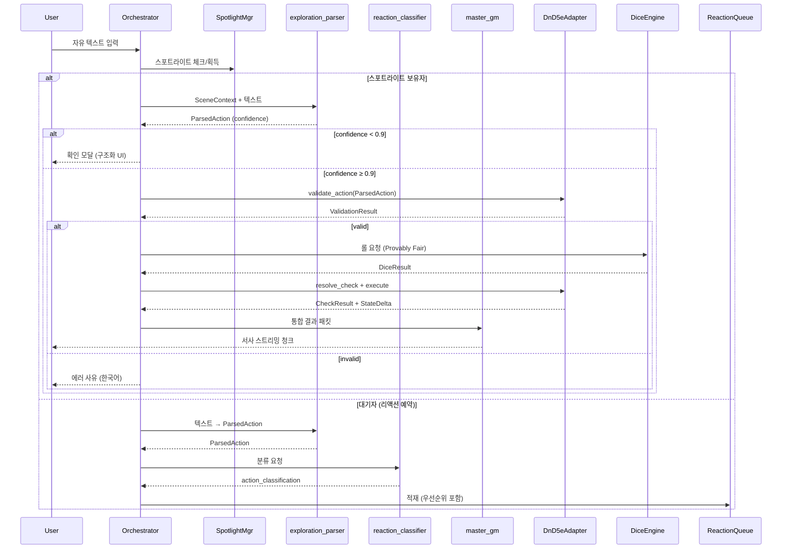
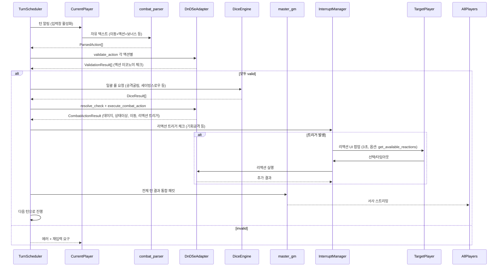
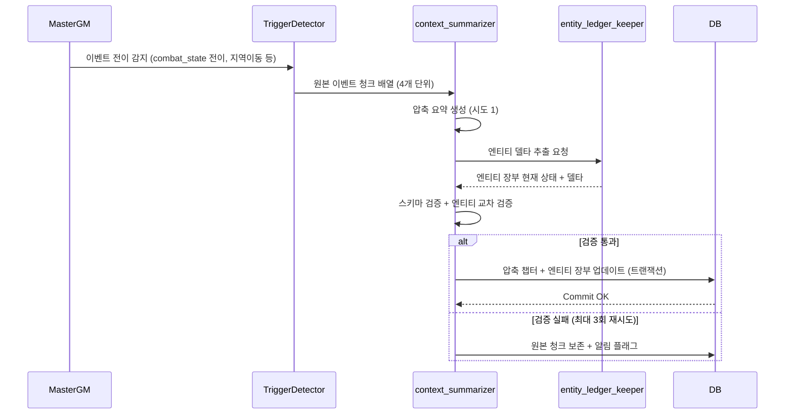
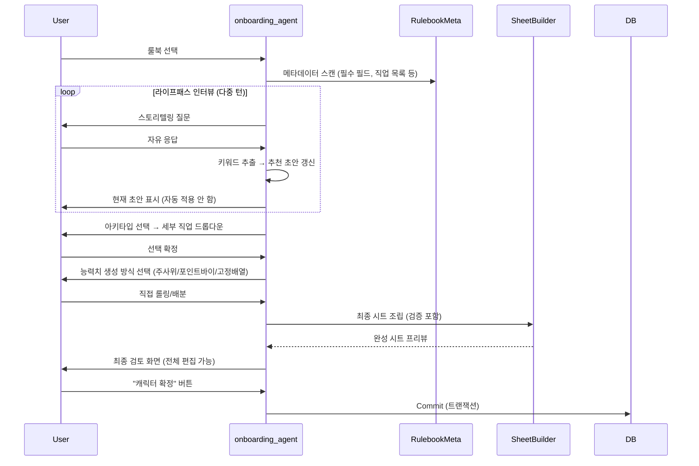

# [GPTRPG] 코어 엔진 기획 명세서 (Core Engine Spec Sheets)

## 1. 프로젝트 개요 (Project Overview)

본 프로젝트는 정통 오프라인 TRPG가 가진 높은 진입장벽(구인난, 복잡한 룰북 탐독, GM의 독박 노동)을 LLM(대형 언어 모델) 멀티 에이전트와 하드코딩 시스템 연산 엔진의 하이브리드 결합으로 혁신하는 온라인 TRPG 플랫폼이다. 플레이어의 무한한 서사적 자유도를 보장하면서도, 시스템 코드 기반의 규칙 통제를 통해 AI의 할루시네이션(환각 현상)을 완벽하게 방어하는 것을 최종 목표로 한다.

**핵심 설계 원칙 (Core Design Principles):**

1. **LLM은 파서(Parser)일 뿐, 저지(Judge)가 아니다** — 자유 텍스트를 결정론적 액션 페이로드로 변환만 하며, 모든 판정·연산·검증은 백엔드 하드코딩 로직이 전담한다.
2. **룰북별 전용 어댑터 패턴** — 범용 메카닉 빌더로 룰북을 추상화하지 않고, 각 룰북(D&D 5e, Dungeon World, CoC 등) 고유의 수학·액션 이코노미·판정 체계를 전용 어댑터로 구현한다.
3. **Provably Fair 주사위** — 암호학적 시드 커밋/공개 방식으로 서버·클라이언트 양측이 검증 가능한 난수 생성을 보장한다.
4. **액션 이코노미 백엔드 강제** — 파서가 어떤 메타데이터를 보내든, 턴당 Action/Bonus/Reaction 카운터는 백엔드가 100% 관리·검증한다.
5. **컨텍스트 주입형 파싱** — 파서는 현재 씬 엔티티, 액터 상태, 환경 정보를 백엔드로부터 주입받아 참조만 하며, 신규 엔티티 생성이나 상태 변경을 시도하지 않는다.
6. **신뢰도 기반 폴백** — 파싱 신뢰도(confidence) 임계값 미만 시 구조화된 액션 선택 UI로 강제 전환하여 오해석을 원천 차단한다.

---

## 2. 핵심 아키텍처 및 시스템 사양 (Core Architecture)

### 2.1. 룰북 추상화 포맷 (Abstract Rulebook Format)

다양한 형태의 상용/인디 룰북을 시스템과 LLM이 동시에 정량적으로 인지할 수 있도록 구조화된 메타데이터 규격을 채택한다.

**룰북 어댑터 인터페이스 (Rulebook Adapter Interface):**

각 룰북은 다음 인터페이스를 구현한 전용 어댑터를 제공한다. 백엔드는 이 인터페이스를 통해서만 룰북 로직과 통신한다.

```python
class RulebookAdapter(ABC):
    @property @abstractmethod
    def system_id(self) -> str: ...                    # 예: "dnd5e_srd_5_1"
    
    @property @abstractmethod
    def action_type_enum(self) -> type[Enum]: ...      # 룰북 고유 액션 타입 닫힌 열거형
    
    @abstractmethod
    def build_parser_prompt(self, context: SceneContext) -> str:
        """룰북별 파서 프롬프트 템플릿 + Few-shot 예시 반환 (백엔드가 LLM 호출 시 사용)"""
    
    @abstractmethod
    def validate_action(self, action: ParsedAction, actor: Character, context: SceneContext) -> ValidationResult:
        """액션 이코노미, 리소스, 사거리, 대상 유효성 등 실행 가능 여부 사전 검증"""
    
    @abstractmethod
    def resolve_check(self, action: ParsedAction, actor: Character, target: Entity, dice_roll: int, context: SceneContext) -> CheckResult:
        """판정 연산 핵심: DC 계산, 수정치 합산, 어드밴티지/디스어드밴티지 최종 결정, 성공/실패/크리티컬 판정"""
    
    @abstractmethod
    def execute_combat_action(self, action: ParsedAction, actor: Character, dice_results: list[int], context: SceneContext) -> CombatActionResult:
        """전투 액션 실행: 데미지, 상태이상, 이동, 리액션 트리거 등 연산"""
    
    @abstractmethod
    def get_available_reactions(self, actor: Character, trigger: TriggerEvent, context: SceneContext) -> list[ReactionOption]:
        """인터럽트/리액션 가능 목록 반환 (3초 UI 팝업용)"""
    
    @abstractmethod
    def calculate_dc(self, action: ParsedAction, target: Entity, situation: SituationContext) -> int:
        """DC/난이도 계산 로직 (룰북마다 완전 다름)"""
```

**파서 입력/출력 계약 (Parser I/O Contract):**

백엔드가 LLM에 전달하는 컨텍스트(`SceneContext`)와 파서가 반환해야 하는 구조화된 액션(`ParsedAction`)은 다음과 같이 엄격히 정의된다.

```json
// SceneContext (백엔드 → 파서 주입)
{
  "entities": [
    {"entity_id": "gate_guard_01", "name": "성문 경비병", "type": "neutral", "distance_feet": 10, "conditions": [], "ac": 14, "hp_current": 11, "visible": true}
  ],
  "actor": {
    "action_used": false, "bonus_action_used": false, "reaction_used": false,
    "movement_used_feet": 0, "movement_total_feet": 30,
    "spell_slots": {"1": 4, "2": 3}, "class_resources": {"ki": 3},
    "ability_scores": {"str": 16, "dex": 14, "cha": 12},
    "proficiency_bonus": 2, "proficient_skills": ["persuasion", "intimidation"],
    "equipped_weapon": {"id": "longsword", "damage": "1d8+3", "range": 5}
  },
  "lighting": "bright", "terrain_difficulty": "normal",
  "combat_state": null, "initiative_order": null, "current_turn_index": null,
  "recent_narrative": "선술집에서 나와 성문으로 향함. 경비병 둘이 서 있음."
}

// ParsedAction (파서 → 백엔드 반환)
{
  "action_type": "INTERACT",
  "confidence": 0.92,
  "target": {"type": "ENTITY_REF", "entity_id": "gate_guard_01"},
  "requested_skill": "persuasion",
  "spell_id": null,
  "spell_slot_level": null,
  "weapon_id": null,
  "movement": null,
  "advantage_sources": [],
  "disadvantage_sources": [],
  "resource_cost_estimate": {"gold": 5},
  "ambiguities": [],
  "fallback_action": "INTERACT"
}
```

### 2.2. 플레이 인터페이스 및 연출 최적화 (Play Interface)

LLM의 물리적 레이턴시(응답 지연)를 인간적인 매력으로 승화시키고, 플레이어에게 기물(Dice)의 손맛을 제공하기 위한 인터랙티브 시퀀스를 제공한다.

- **상태 트랜잭션 분리 (Pending & Commit):** 아이템이나 재화의 실제 차감은 주사위를 굴리기 전이 아니라, 주사위 결과에 따른 최종 시나리오가 백엔드에서 확정(Commit)될 때 일괄 처리하여 데이터 유실 및 롤백 리스크를 원천 차단한다.
- **주사위 연출 동기화 (Dice-First Narrative):** 플레이어의 주사위 굴리기 액션이 확정되면, 백엔드가 Provably Fair 프로토콜로 난수를 생성·검증한 뒤 결과를 GM 에이전트에 전달한다. GM 에이전트는 **확정된 수치 결과만을 입력받아** 서사를 생성하므로, 사전 분기 스케치(Speculative Execution)에 따른 레이스 컨디션과 컨텍스트 오염을 원천 차단한다.
- **인라인 스트리밍 로그 연출:** 대화 및 내러티브는 문장 단위 청크(Chunk)로 스트리밍되며, 주사위 연출 시점에서는 자동으로 일시정지하여 사용자의 물리적 주사위 굴리기(또는 버튼 액션)를 유도한다.

### 2.3. 하이브리드 전투 엔진 (Hybrid Combat Engine)

정통 전술 TRPG의 핵심인 격자 전투의 재미를 유지하기 위해 백엔드와 AI의 역할을 엄격히 분리한다.

- **N×N 그리드 좌표 연산 하드코딩:** LLM의 기하학적 공간 계산 오류(공간 치매)를 방지하기 위해 이동 거리, 사거리, 범위 공격(AoE), 포위 보정 등은 백엔드 시스템 코드가 100% 계산한다.
- **전투/행동 파서 (Combat/Action Parser):** 플레이어의 자유 텍스트 입력을 **룰북 어댑터가 제공하는 프롬프트 템플릿**을 통해 구조화된 액션 페이로드(`ParsedAction`)로 변환한다. 파서는 **판정·연산·검증에 일절 관여하지 않으며**, 오직 "텍스트 → 결정론적 데이터" 변환만 담당한다. 파싱 신뢰도(confidence)가 임계값(기본 0.9) 미만일 경우 클라이언트에 확인 모달을 띄워 오해석을 방지한다.
- **타임아웃 인터셉트 (비동기 예외 개입):** 기회 공격, 방어막 주문 등 내 턴이 아닐 때 개입하는 예외 규칙은 백엔드가 타이밍을 감지하여 화면에 찰나의 '선택창 UI(3초 타이머)'를 팝업하는 형태로 제어한다. LLM은 개입 타이밍을 계산하지 않고 확정된 결과의 묘사만 전담한다.
- **룰북별 그리드 UI 제어 전략:** D&D 스타일은 모눈종이 격자선과 전술 UI를 노출하고, 던전월드 등 상대적 구역(Zone) 스타일은 격자선을 숨김(Invisible) 처리한 뒤 화이트보드처럼 토큰을 자유롭게 배치하게 유도한다.

**전장 좌표계 영속성 (Persistent Battlefield Coordinates):**
탐험 모드('마음의 눈')에서도 논리적 그리드 좌표계는 백엔드에서 지속 유지된다. 전투 전환 시 별도 팝업 그리드를 생성하는 것이 아니라, 기존 좌표계를 그대로 확대 렌더링하여 **공간적 연속성(엄폐물, 기둥, 고도 차이 등)을 보존**한다. 이는 "탐험 중 기둥 뒤에 숨음 → 전투 진입 → 기둥 위치 불일치"로 인한 몰입 파괴를 방지한다.

### 2.4. 인터랙티브 온보딩 (Interactive Onboarder)

복잡한 캐릭터 시트 생성 과정을 지루한 문서 기입이 아닌, 롤플레잉(RP) 그 자체로 녹여내어 초보자의 진입장벽을 제거한다.

- **인터랙티브 라이프패스 가이드:** [온보딩 서브 에이전트]가 선택된 룰북 메타데이터를 스캔한 뒤 필수 정보를 유도하는 질답형 내러티브 스토리텔링 질문을 던져 '백지 공포증'을 해소한다.
- **정성 데이터 아카이브 매핑:** 유저가 잡담하듯 입력한 백스토리("뒷골목에서 소매치기하며 자람")에서 키워드를 추출해 [추천 직업: 도적] 등으로 시트 초안을 자동 빌드하고 데이터는 영구 보관되어 추후 시나리오적 장치로 인용된다.
- **가이드형 반자동 확정 루프 (Guided Semi-Automatic Commit):**
  1. 백스토리 입력 → 키워드 파싱 → **추천 직업/능력치 분배 초안 제시 (자동 적용 안 함)**
  2. 유저가 초안 수정/확인 → **아키타입 선택(전사형/마법형/기술형/치유형) → 세부 직업 드롭다운**
  3. 능력치 생성: **룰북 규정 방식(주사위 롤/포인트 바이/고정 배열) 중 선택 → UI에서 직접 롤링 또는 배분**
  4. 최종 확정: **모든 수치·선택사항을 유저가 명시적으로 '확정' 버튼 터치 시에만 DB Commit**
  5. 전 과정 되돌리기(Undo) 및 수동 수정 모드 상시 제공 → **플레이어 주체성 보장**

### 2.5. 멀티플레이어 채팅 및 행동 제어 (Multiplayer Coordination)

웹소설 형태의 온라인 환경에서 발생하는 동시다발적 채팅 난사(Chat Flooding)와 문맥 붕괴를 제어하는 통합 오케스트레이터 구조를 갖춘다.

- **전투 모드 스위치 (combat_state):** 마스터 GM 에이전트가 "전투 시작"을 판단하면 백엔드 글로벌 플래그가 켜지며 [자유 대화 모드]에서 [엄격한 턴제 스케줄러 모드]로 알고리즘이 전환된다. 이때는 주사위 선공 순서(Initiative) 큐에 따라 차례가 온 유저의 입력창만 활성화된다.
- **탐험 모드 스포트라이트 및 리액션 큐 (시스템 레벨 액션 분류):**
  - 비전투 상황에서 첫 입력자가 **스포트라이트 토큰**을 획득하며, 타 유저 메인 입력창은 대기(Pending) 상태가 된다.
  - 대기 중인 유저는 **리액션 예약 버튼**으로 행동을 비동기 큐에 적재한다.
  - **우선순위 로직은 LLM이 아닌 백엔드 시스템 코드가 수행한다.** 각 액션은 파싱 시 `action_classification` 필드(INTERRUPT_DEFENSIVE / REACTION / FREE_ACTION / ACTION / BONUS_ACTION 등)를 부여받으며, 백엔드는 하드코딩된 우선순위 테이블에 따라 실행 순서를 결정론적으로 정렬한다. GM 에이전트는 정렬된 결과만 서사로 융합한다.

- **AFK 타임아웃 인젝터 (현실적 시간 설정):**

| 모드 | 기본 제한시간 | 연장 가능 | 타임아웃 시 처리 |
|------|--------------|-----------|-----------------|
| 전투 (숙련) | 90초 | 방장 설정 180초까지 | `idle_timeout` 패킷 → 무반응 처리 → 다음 턴 강제 진행 |
| 전투 (초보) | 180초 | 방장 설정 300초까지 | 동일 + 가이드 툴팁 제공 |
| 탐험 (일반) | **무제한 (소프트 5분)** | - | 스포트라이트만 자동 반납, 패널티 없음 |
| 탐험 (긴박/추격) | 60초 | - | 스포트라이트 반납 + 상황적 긴박감 연출 |

- **상반 행동 처리 (Initiative-Based Resolution):**
  동시 상반 선언(뇌물 vs 기습 등) 발생 시, **시스템이 인티셔티브/액션 이코노미 규칙에 따라 선후를 강제한다.** 예: 인티셔티브 높은 쪽 액션 선처리 → 결과에 따른 상황 변경(경비병 태도 적대화 등) → 후순위 액션 재판정(DC 상승, 어드밴티지 상실 등). **LLM이 임의로 융합하지 않고, 규칙이 만든 파국을 서사로만 묘사한다.**

### 2.6. 멀티 서브에이전트 오케스트레이션 아키텍처 (Multi-Sub-Agent Orchestration)

본 플랫폼은 단일 거대 LLM이 모든 역할을 수행하는 대신, **역할별로 특화된 경량 서브에이전트들을 오케스트레이터가 조율**하는 구조를 취한다. 이는 **토큰 예산 최적화, 지연시간 단축, 장애 격리, 프롬프트 엔지니어링 독립성**을 확보하기 위함이다.

#### 2.6.1. 서브에이전트 레지스트리 (Sub-Agent Registry)

| 에이전트 ID | 역할 | 모델 티어 | 호출 방식 | 상태성 | 주요 입/출력 |
|-------------|------|-----------|-----------|--------|--------------|
| `master_gm` | 마스터 내러티브 총괄, 최종 서사 생성, 세션 페이싱 | Heavy (Main) | 상시 스트리밍 | Stateful (세션 전체) | 입력: 통합 컨텍스트 패킷 / 출력: 문장 청크 스트림 |
| `combat_parser` | 자유 텍스트 → `ParsedAction` 변환 (D&D 5e 특화) | Light (Fine-tuned) | 동기 호출 | Stateless | 입력: `SceneContext` + 유저 텍스트 / 출력: `ParsedAction` (confidence 포함) |
| `exploration_parser` | 비전투 자유 텍스트 → 구조화 액션/대화 의도 추출 | Light | 동기 호출 | Stateless | 입력: `SceneContext` + 유저 텍스트 / 출력: `ParsedAction` 또는 `DialogueIntent` |
| `onboarding_agent` | 라이프패스 인터뷰, 캐릭터 생성 가이드 | Medium | 대화형 다중 턴 | Stateful (온보딩 세션) | 입력: 룰북 메타데이터 + 유저 응답 / 출력: 질문, 추천 초안, 검증 피드백 |
| `rules_interpreter` | 룰북 애매모호 조항 해석, 홈브루 룰 검증 | Medium (RAG) | 비동기 조회 | Stateless | 입력: 룰북 ID + 질의 / 출력: 판정 근거 + 레퍼런스 |
| `context_summarizer` | 이벤트 청크 압축, 롤업 요약 생성 | Light (Gemma/Phi) | 백그라운드 배치 | Stateless | 입력: 원본 이벤트 JSON 배열 / 출력: 압축 요약 + 엔티티 장부 델타 |
| `entity_ledger_keeper` | 고유 명사/NPC/아이템 상태 영구 관리 | Light (Embedding) | 이벤트 드리븐 | Stateful (영구) | 입력: 이벤트 압축 시 엔티티 델타 / 출력: 업데이트된 엔티티 장부 |
| `reaction_classifier` | 리액션 큐 적재 액션의 `action_classification` 부여 | Ultra-Light (Rule-based + Tiny) | 동기 인라인 | Stateless | 입력: `ParsedAction` + 컨텍스트 / 출력: 분류 라벨 + 우선순위 |
| `dice_narrator` | 주사위 결과 수치 → 맛깔난 연출 문장 (크리티컬/펌블 특화) | Light | 동기 호출 | Stateless | 입력: `CheckResult` + 상황 컨텍스트 / 출력: 연출 문장 (단문) |
| `initiative_resolver` | 인티셔티브 롤 동시 처리, 타이브레이커 적용 | Ultra-Light (Deterministic) | 동기 호출 | Stateless | 입력: 참여자 리스트 + DEX/특성 / 출력: 정렬된 턴 오더 |

> **모델 티어 정의:** Heavy=메인 모델(70B+), Medium=중형(7B-30B, RAG 포함), Light=경량(1B-7B, 파인튜닝), Ultra-Light=규칙기반/임베딩/1B 미만

#### 2.6.2. 오케스트레이션 플로우 (Orchestration Flows)

**A. 탐험 모드 메인 루프 (Exploration Main Loop)**



**B. 전투 모드 턴 처리 (Combat Turn Processing)**



**C. 이벤트 압축 및 아카이빙 (Background Compression Pipeline)**



**D. 온보딩 플로우 (Onboarding Flow)**



#### 2.6.3. 에이전트 간 통신 프로토콜 (Inter-Agent Communication)

- **메시지 버스:** 내부 gRPC 스트리밍 (동기) + Redis Streams (비동기/백그라운드)
- **공통 컨텍스트 객체:** `OrchestrationContext` — 세션 ID, 현재 씬, 액터 상태, 룰북 어댑터 레퍼런스, 토큰 예산 등을 불변 객체로 전달
- **응답 래퍼:** 모든 에이전트 응답은 `AgentResult<T>` 래퍼로 통일
  ```python
  @dataclass
  class AgentResult(Generic[T]):
      success: bool
      data: T | None
      error_code: str | None        # "LOW_CONFIDENCE", "VALIDATION_FAILED", "TIMEOUT", "MODEL_ERROR"
      error_message: str | None     # 유저 표시용
      latency_ms: int
      token_usage: TokenUsage
      fallback_suggestion: str | None
  ```
- **타임아웃 정책:** 동기 호출 2초(Light), 5초(Medium), 15초(Heavy) — 초과 시 폴백 동작 트리거
- **재시도 정책:** `MODEL_ERROR` 시 지수 백오프 최대 2회, `VALIDATION_FAILED`는 재시도 안 함(상위 로직으로 위임)

#### 2.6.4. 상태 관리 및 격리 (State Management & Isolation)

| 상태 범위 | 저장소 | 수명주기 | 접근 권한 |
|-----------|--------|----------|-----------|
| 세션 레벨 (캠페인, 파티, 월드 상태) | PostgreSQL + JSONB | 캠페인 영구 | Master GM, Context Summarizer (R/W), Others (R) |
| 씬 레벨 (전투 그리드, 엔티티 위치, 이니셔티브) | Redis (TTL 24h) | 씬 지속 중 | Combat Parser, Rulebook Adapter, Turn Scheduler (R/W) |
| 턴 레벨 (Pending 액션, 주사위 결과, 중간 연산) | In-Memory (Orchestrator) | 턴 종료 시 소멸 | Turn Scheduler, Dice Engine (R/W) |
| 온보딩 레벨 (임시 시트 초안, 인터뷰 진행도) | Redis (TTL 1h) | 온보딩 완료 시 | Onboarding Agent (R/W) |
| 엔티티 장부 (NPC, 아이템, 단서 영구) | PostgreSQL (별도 테이블) | 영구 | Entity Ledger Keeper (R/W), Context Summarizer (R), Master GM (R) |

**격리 원칙:** 에이전트 간 **직접 상태 공유 금지**. 모든 상태 변경은 오케스트레이터를 거쳐 **명시적 컨텍스트 업데이트**로만 수행. 백엔드 시스템 코드(룰북 어댑터, 주사위 엔진)는 **완전 무상태(Stateless)**로 유지.

#### 2.6.5. 에러 처리 및 폴백 전략 (Error Handling & Fallback)

| 실패 지점 | 감지 주체 | 폴백 동작 | 사용자 임팩트 |
|-----------|-----------|-----------|--------------|
| `combat_parser` confidence < 0.7 | Orchestrator | 구조화 액션 선택 UI 강제 오픈 | 약간의 지연, 정확성 보장 |
| `master_gm` 스트리밍 타임아웃/에러 | Orchestrator | 템플릿 기반 기본 연출 문장 생성 + "GM이 잠시 생각하는 중..." 표시 | 서사 품질 저하, 진행 가능 |
| `context_summarizer` 검증 3회 실패 | Background Worker | 원본 청크 보존 + 알림 플래그 + 수동 압축 버튼 제공 | 토큰 예산 증가, 데이터 손실 없음 |
| `dice_narrator` 에러 | Orchestrator | 기계적 결과 텍스트("주사위 17, 성공!") 직출력 | 연출 맛 떨어짐, 정보 전달은 됨 |
| `rules_interpreter` 미응답 | Orchestrator | 캐시된 룰북 인덱스 검색 폴백 / 없으면 "룰북 참조 불가" 안내 | 판정 지연 가능 |
| WebSocket 재연결 중 턴 진행 | Turn Scheduler | 서버 측에서 턴 일시정지(최대 30초) → 재연결 시 델타 동기화 후 재개 | 전투 흐름 중단 방지 |

#### 2.6.6. 토큰 예산 관리 (Token Budget Management)

- **세션당 총 예산:** 128k 토큰 (모델 컨텍스트 윈도우 기준)
- **할당 전략:**
  - Master GM 프롬프트: 40k (시스템 프롬프트 + 룰북 요약 + 엔티티 장부 + 최근 20턴)
  - `combat_parser`/`exploration_parser`: 2k each (Few-shot + SceneContext)
  - `onboarding_agent`: 8k (다중 턴 대화 컨텍스트)
  - `context_summarizer`: 4k (원본 청크 + 스키마)
  - 예비: 10k (비상 압축, 에러 복구)
- **압축 트리거:** Master GM 컨텍스트 사용률 80% 초과 시 → `context_summarizer` 비동기 호출 → 압축 완료 시 컨텍스트 교체 (원자적 스왑)
- **비상 압축:** 95% 초과 시 → 강제 롤업 실행 (최신 20턴만 보존, 이전 모두 압축)

## 3. 초기 론칭 및 유입 전략 (Launch Strategy)

### 3.1. 표준 스타터 룰북 세트 라인업

상업용 유료 라이선스 법적 분쟁을 회피하고 서비스의 안정적 구축을 유도하기 위해 완전 오픈 라이선스 및 세계적으로 공개된 SRD 문서를 기반으로 한 3대 표준 스타터 팩을 기본 탑재한다.

1. **[정통 판타지] 크로니클 d20 (Chronicle d20) - ★오픈 베타 메인 타이틀★**
    - 기반 시스템: D&D 5e SRD 5.1(CC-BY-4.0) 문서 기반 (고유 명칭 및 공식 세계관 명사는 리브랜딩 우회).
    - 선정 이유: **가장 복잡한 액션 이코노미·전술 그리드·주문 슬롯·상태이상 시스템을 가진 D&D 5e를 첫 프로토타입 타겟으로 삼아, 하이브리드 엔진의 완결성을 검증한다.** 통과 시 타 룰북 어댑터 전개에 확실한 기반이 된다. **전투 파서 파인튜닝 데이터셋 1순위 구축 대상.**
2. **[서사 판타지] 월드 앤 어드벤처 (World & Adventure)**
    - 기반 시스템: 던전 월드 (Dungeon World) 오픈 라이선스(CC BY 3.0) 완벽 인용.
    - 특징: 주사위 눈보다 플레이어의 상상력과 서사가 판정을 지배하는 시스템. 그리드 선을 숨긴 '상대적 구역(Zone) 모드'로 라이트 유저 입문에 최적화.
3. **[코스믹 호러/미스터리] 미지의 그림자 (Shadow of the Unknown)**
    - 기반 시스템: 자체 개발 d100(퍼센타일) 다이스 규칙 (크툴루의 부름 우회 규격).
    - 특징: 광기 수치와 미스터리 중심. 캐릭터 능력치가 낮아 실패와 제약에서 오는 절박한 쫀득함 극대화.

### 3.2. 오픈 베타 메인 시나리오 표준 시퀀스: [나인 웰의 그림자]

| **단계** | **연출 및 흐름 (UI/UX)** | **백엔드 엔진 구동 프로세스 (Engine Sync)** |
| --- | --- | --- |
| **1단계: 온보딩** | 선술집 배경 깔림. 잡담하듯 출신 소개. "뒷골목 고아 출신 마법사 로빈입니다." | **[온보딩 에이전트]**가 필수 스탯 유도 질문 처리. 정성 데이터 분석 후 **추천 직업/능력치 초안 제시(자동 적용 안 함). 유저가 아키타입 선택 → 세부 직업 드롭다운 → 주사위/포인트바이 직접 롤링 → 명시적 확정 버튼으로 Commit.** |
| **2단계: 탐험 & 갈등** | 성문 앞 경비병 조우. A는 뇌물 선언, B는 기습 선언 (상반 행동). | **[리액션 큐]**에 행동 적재. **파서가 각 행동을 구조화된 페이로드로 변환 → 백엔드가 인티셔티브/액션 이코노미로 선후 강제 정렬 → 순차 판정 실행(뇌물 실패 → 경비병 적대화 → 기습 판정 DC 상승) → GM 에이전트가 결과 융합 → `combat_state = TRUE` 스위치.** |
| **3단계: 전술 전투** | 15×15 그리드 렌더링 (기존 탐험 좌표계 확대). 주사위 기반 행동 턴 큐 정렬. | 유저 자유 텍스트 → **[전투 파서]**가 `ParsedAction` 변환 → **D&D 5e 어댑터 `validate_action` 검증(액션 이코노미, 슬롯, 사거리) → Provably Fair 주사위 롤링 → `resolve_check` 판정 → `execute_combat_action` 연산(데미지, 상태이상, 이동) → 결과 GM 에이전트 전달 → 서사 연출. 적 도주 시 백엔드 감지 → **[기회 공격 인터럽트 UI(3초)]** 팝업. |

---

# [GPTRPG] 통합 개발 핸드오프 명세서

## 1. 프로젝트 개요 (Project Overview)

본 문서는 LLM 멀티 에이전트 아키텍처와 하드코딩 규칙 연산 엔진을 결합한 하이브리드 온라인 TRPG 플랫폼 [GPTRPG]의 최종 개발 사양서이다. 실제 코드를 구현할 개발팀은 본 사양서에 명시된 규칙 통제 메커니즘과 데이터 흐름을 준수하여 백엔드 코어 및 클라이언트를 빌드해야 한다.

## 2. 시스템 공통 코어 및 통신 사양

### 2.1. 단일 WebSocket 전이중 통신망 및 문장 청크(Chunk) 프로토콜

실시간 기물 동기화 및 타임아웃 인터셉트의 0.1초 미만 레이턴시 보장을 위해 메인 통신 프로토콜은 WebSocket 채택으로 단일화한다.

- **토큰 단위 스트리밍 폐기:** 글자 한 자씩 전송하는 방식은 네트워크 오버헤드가 크고 문장 중간 인터럽트 발생 시 파싱 에러를 유발하므로 금지한다.
- **문장 청크(Chunk) 전송:** AI GM이 완성된 단락이나 문장 단위로 결과를 서버 백엔드에 넘기면, 백엔드가 무결성을 검증한 뒤 단일 JSON 패킷으로 클라이언트에 송신한다.
- **프론트엔드 타이핑 연출:** 클라이언트는 수신된 문장 청크 데이터를 CSS/JS 타이핑 효과로 화면에 렌더링하여 실시간 대화의 시각적 손맛을 구현한다.

**재연결 및 동기화 프로토콜 (Reconnection & Sync Protocol):**
- 각 패킷에 시퀀스 번호(`seq`) 부여, 클라이언트는 `last_acked_seq` 유지
- WebSocket 재연결 시 `last_acked_seq` 전송 → 서버는 누락 패킷 델타 재전송
- 하트비트(5초 간격) + 펑퐁으로 연결 생존 확인, 3회 실패 시 재연결 시도
- GM 에이전트 스트리밍 중 재연결 발생 시: 마지막 완료된 청크부터 재생성 요청 (멱등성 보장)

### 2.2. 데이터베이스 및 트랜잭션 무결성 (PostgreSQL + JSONB)

- **하이브리드 스토리지 설계:** 계정 정보, 게임방 세션 상태, 실시간 턴 순서 큐(Queue) 등 데이터 무결성이 엄격해야 하는 영역은 PostgreSQL의 고정 테이블 스키마로 관리한다. 가변적인 룰북 템플릿과 캐릭터 데이터 시트는 상위 테이블 내 `JSONB` 필드에 격리하여 저장한다.
- **상태 트랜잭션 (Pending & Commit 분리):** 플레이어가 행동 선언을 입력했을 때 자원(골드, HP 등)을 즉시 DB에서 차감하지 않고 가상 연산 컨텍스트에 'Pending' 상태로 묶어둔다. 이후 주사위 결과 및 시나리오 분기가 확정되는 시점에 데이터베이스에 일괄 'Commit' 처리하여 패킷 손실로 인한 데이터 왜곡을 방지한다.

**자주 쿼리되는 필드 컬럼 분리 (Column Extraction for Hot Fields):**
JSONB 내 캐릭터 시트에서 다음 필드는 별도 컬럼으로 분리하여 인덱싱·조회 성능을 보장한다:
`level`, `class`, `subclass`, `hp_current`, `hp_max`, `ac`, `ability_scores` (6개 컬럼), `proficiency_bonus`, `spell_slots_json` (압축), `initiative_bonus`.
JSONB에는 인벤토리, 백스토리, 임시 버프, 선택한 특성 등 **가변적이고 조회 빈도 낮은 데이터만 저장**한다.

## 3. 하이브리드 인카운터 전투 엔진

### 3.1. 소규모 인카운터 맵 (Encounter Map) 아키텍처

- **서사 탐험과 전술 전투의 분리:** 던전 전체를 대형 그리드로 동기화하는 비효율적 방식을 폐기한다. 평소 탐험은 마스터 GM의 서사와 저장된 공간 트리거로 진행하는 '마음의 눈(Theatre of the Mind)' 모드로 구동된다.
- **소규모 그리드 전환:** 전투가 터지는 순간 포켓몬스터 인카운터 진입 연출과 함께 화면에 최대 15×15 크기의 전술 그리드 모눈종이가 팝업된다.
  - **좌표계 연속성:** 탐험 모드에서 유지되던 논리 그리드 좌표를 전투 진입 시 그대로 계승하여 렌더링한다. 별도 좌표계 생성 금지.

### 3.2. 서버 사이드 2D 배열 연산 및 규칙 통제

- **백엔드 전담 기하학 연산:** LLM의 공간 기하학적 환각(공간 치매)을 원천 차단하기 위해, 15×15 그리드 내에서의 캐릭터 이동 반경(A* 알고리즘), 무기/주문 사거리, 범위 공격(AoE), 엄폐물 판정, 전장의 안개(시야/Fog of War) 직선 광선 연산은 100% 백엔드 서버 코드가 전담 연산한다.
- **전투 서브 에이전트의 역할:** 플레이어가 선언한 자유 서사 텍스트 액션을 시스템 파라미터(X, Y 좌표값 및 행동 타입 변수)로 정량 변환하여 서버에 전달한다. 서버 연산 결과값(데미지 수치 등)을 수신하면 이를 다시 쫀득한 서사 연출 문장으로 복원하여 마스터 GM 라우터에 토스한다.
- **완벽한 기습/시야 시스템 (Server-Authoritative Fog of War):**
  서버가 각 액터의 시야 광선(Bresenham/레이캐스팅)을 실시간 계산하여 **클라이언트에 렌더링할 엔티티 목록만 전송**한다. 시야 밖 적/오브젝트는 클라이언트 메모리에조차 로드되지 않음(원천 은닉). 문 열기/코너 돌기 시 서버가 시야 변화 감지 → 신규 엔티티 패킷 전송 → 클라이언트 페이드인 연출. **맵 전체 데이터가 클라이언트에 존재하는 구조 아님.**

### 3.3. 비동기 예외 개입 (타임아웃 인터셉트)

- **시스템 자동 인터셉트 리스너:** 적 토큰이 이동 중 플레이어의 근접 사거리를 벗어나는 등 기회 공격 조건 발생 시 백엔드가 패킷 송신을 일시 정지(Pause)시킨다.
- **찰나의 선택 UI 연출:** 해당 유저 화면에 3초 제한 시간 타이머와 함께 [기회 공격/반격 주문 발동] 비동기 입력창을 열어준다. 타임아웃 종료 시까지 입력이 없으면 패킷 정지를 해제하고 원래 턴 흐름을 이어간다.
  - **리액션 옵션은 백엔드가 룰북 어댑터 `get_available_reactions`로 계산하여 제공**하며, LLM이 임의로 생성하지 않는다.

## 4. 구조화 서사 기억 매니저 (Structured Narrative Ledger)

### 4.1. 3단계 기억 보존 메커니즘

- **1단계: 날것의 대화 윈도우 (최근 20턴):** 유저와 AI GM 간의 가장 최근 티키타카 문맥 20턴은 날것(Raw Text)의 형태로 프롬프트 컨텍스트에 상시 유지하여 대화의 자연스러운 뉘앙스와 말버릇을 보존한다.
- **2단계: 구조화 서사 레저 (Structured Event Chunk):** 기계적인 턴 카운팅(40턴 등)을 폐기한다. 마스터 GM 에이전트가 내러티브 상황을 파악하여 '전투 종료(combat_state 플래그가 TRUE에서 FALSE로 전이)', '지역 이동 완료' 등 **이벤트 상태 전이 트리거**를 감지하는 순간 컨텍스트 관리 서브 에이전트를 가동한다. 에이전트는 밀려나는 과거 서사를 주요 사건, 획득 단서, 수치 변동량이 매핑된 압축 JSON 규격 파일로 생성하여 DB의 `JSONB` 필드에 영속화한다.
- **3단계: 계층형 상위 아카이빙 (Roll-up 요약) 및 글로벌 엔티티 장부(Entity Ledger):** 이벤트 단위 JSON 블록이 4개 이상 누적되어 하나의 큰 시나리오 에피소드가 완결되면, 이를 한 줄의 글로벌 자연어 요약과 누적 스탯 변화량으로 병합 압축(상위 트리로 Roll-up)하여 전체 토큰 예산이 선형 폭발하는 현상을 영구 방어한다. **이때 자연어 요약 압축 과정에서 사소하지만 중요한 정성적 디테일이 소실되는 것을 방지하기 위해, 데이터베이스 내에 독립적인 '글로벌 고유 명사/엔티티 장부(Entity Ledger)' 테이블을 구축한다**. **이벤트가 압축되더라도 그 과정에서 파생된 고유 NPC(이름, 외모 특징, 호감도 상태), 핵심 단서, 획득 고유 아이템의 상태 값은 영구 보존 풀에 격리 저장되어 LLM 프롬프트에 상시 주입되도록 설계한다**.

**압축 트리거 및 검증 메커니즘 (Compression Trigger & Verification):**
- 트리거: `combat_state` 전이, 지역 이동, 주요 NPC 사망/동맹, 퀘스트 단계 완료 등 **명시적 이벤트 플래그** 기반 (턴 수 아님)
- 압축 모델: **경량 전용 모델(예: Gemma-2B, Phi-3-mini) + 규칙 기반 후처리** — GM 메인 모델과 분리하여 비용/속도 최적화
- 검증: 압축 결과 JSON이 스키마 준수 여부 + 엔티티 장부와 교차 검증(누락된 고유 명사 없는지) → 실패 시 재시도(최대 3회) → 최종 실패 시 원본 이벤트 청크 보존 + 알림
- 롤업 주기: 에피소드 완결 시(이벤트 청크 4개 누적) 자동 실행, 수동 트리거도 제공

### 4.2. 전사적 로그 시스템 및 기념품 컴파일러

- **전체 원본 로그 보존:** 대화 및 연산 아카이빙과 별개로 게임 내에서 발생한 모든 채팅, 연산 로그, 주사위 결과 데이터는 디바이스 파일 형태의 백업 원본으로 100% 서버 데이터베이스에 순차 기록된다.
- **모먼트 연대기 제공:** 게임 캠페인이 최종 엔딩에 도달하여 세션이 완전히 닫히면, 전체 날것의 로그와 구조화 JSON 챕터 아카이브를 빌더 엔진으로 컴파일하여 유저에게 마크다운 및 다운로드 가능한 아카이브 파일로 제공한다.

## 5. 멀티플레이어 통제 및 온보딩 시스템

### 5.1. 탐험 모드 스포트라이트 및 리액션 큐

- **탐험 모드 발언권 제어:** 비전투 상황에서 무분별한 엔터키 연타로 문맥이 꼬이는 현상을 방지하기 위해 '스포트라이트 토큰(Floor Token)' 시스템을 구현한다. 특정 유저가 선제를 잡고 입력을 전송하면 해당 유저에게 스포트라이트가 켜지며 타 유저의 메인 입력창은 잠시 '대기(Pending)' 상태로 락(Lock)된다.
- **비동기 리액션 큐 및 시스템 우선순위 정렬:**
  입력창이 잠긴 유저들은 '리액션 예약 버튼'으로 행동을 비동기 큐에 적재한다. 적재 시 파서가 `action_classification`(INTERRUPT_DEFENSIVE / REACTION / FREE_ACTION / ACTION / BONUS_ACTION)을 부여한다. **백엔드 시스템 코드가 하드코딩된 우선순위 테이블(INTERRUPT_DEFENSIVE > REACTION > FREE_ACTION > ACTION > BONUS_ACTION)로 실행 순서를 결정론적으로 정렬**한다. GM 에이전트는 정렬된 순서대로 컨텍스트를 융합하여 단일 서사로 출력한다.
  - **인티셔티브 기반 강제 순차 처리 (Initiative-Enforced Sequential Resolution):**
    동시 상반 선언 시 **인티셔티브 순서(또는 액션 이코노미 규칙)에 따라 선후를 강제한다.** 선행 액션 결과(상태 변화, 태도 변화, 위치 변화)가 후행 액션의 판정 조건(DC, 어드밴티지, 대상 유효성)에 즉시 반영된다. "둘 다 실패로 융합" 같은 임의 처리 금지. **규칙이 만든 파국을 GM이 서사로만 묘사.**

### 5.2. AFK 타임아웃 인젝터 데몬 (이원화 시스템)

- 글로벌 플래그 `combat_state` 상태에 따라 작동 방식을 이원화하여 현대 온라인 게이머의 빠른 템포와 롤플레잉 몰입 간의 최적의 균형을 맞춘다.

**전투 모드 (`combat_state = TRUE`):**
  - 기본 90초(숙련) / 180초(초보), 방장 설정으로 180~300초 범위 조정 가능
  - 만료 시 `action: "idle_timeout"` 패킷 인젝션 → 백엔드가 **무반응(이동/액션/보너스/리액션 모두 소모 안 함)** 처리 → 다음 턴 강제 진행
  - 타임아웃 10초 전 경고 토스트, 5초 전 효과음으로 인지 보조

**탐험 모드 (`combat_state = FALSE`):**
  - **기본 무제한 (소프트 가이드 5분)** — 강제 타임아웃 없음
  - 5분 경과 시 **스포트라이트 토큰만 자동 반납**, 패널티·서사적 불이익 전면 없음
  - 긴박 상황(추격, 타이머 있는 퍼즐) 별도 트리거로 60초 제한 모드 진입 가능

### 5.3. 롤플레잉 온보딩 및 라이프패스 매퍼

- **시트 작작해라 구간 폐기:** 입문자가 룰북 페이지를 보며 수치를 직접 수동 입력하는 정적 방식을 전면 금지한다.
- **인터랙티브 라이프패스 질문:** [온보딩 서브 에이전트]가 현재 로드된 룰북 메타데이터를 스캔하여 필수 필요 필드(직업, 능력치 등)를 파악한 뒤, 스토리 텔링 질문("선술집 구석에 낡은 마법서를 쥐고 있나요, 단검을 숨기고 있나요?")을 유저에게 던진다.
- **가이드형 반자동 확정 루프 (상세):**
  1. **백스토리 자유 입력** → 키워드 추출 → **추천: [직업: 도적, 능력치: 민첩/매력 중심, 특성: 범죄자 배경]**
  2. **아키타입 선택 UI** (전사형/마법형/기술형/치유형/하이브리드) → 세부 직업 드롭다운 (D&D 5e 13개 클래스)
  3. **능력치 생성 방식 선택**: (1) 4d6k3 주사위 롤링 (버튼으로 6회 직접 굴림) (2) 포인트 바이 (27포인트 슬라이더) (3) 고정 배열 [15,14,13,12,10,8] 드래그 앤 드롭
  4. **종족/배경/특성** 드롭다운 선택 (룰북 SRD 목록에서)
  5. **최종 검토 화면** → 모든 수치 편집 가능 → **"캐릭터 확정" 버튼 터치 시에만 DB Commit**
  6. 전 단계 **되돌리기(Undo) 버튼 상시 제공**, 저장 후에도 레벨업 전까지 재편집 가능(세션 시작 전)

---

## 6. 프로토타입 검증 기준 (Prototype Validation Criteria)

D&D 5e SRD 단독 프로토타입 완성 시 다음 E2E 시나리오가 **수동 개입 없이 자동으로 통과**해야 한다:

| 테스트 케이스 | 입력 예시 | 검증 포인트 |
|--------------|-----------|------------|
| 기본 근접 공격 + 이동 | "고블린한테 다가가서 롱소드로 벤다" | 파서→`ATTACK_MELEE`+이동, `validate_action` 액션/이동 체크, 주사위 롤, AC 비교, 데미지 적용 |
| 보너스 액션 클래스 피처 | "보너스 액션으로 환영의 일격(키 1소모), 액션으로 어택" | `validate_action` 보너스액션 카운터/키 리소스 체크, 두 액션 동시 처리 |
| 주문 시전 + 업캐스트 | "파이어볼 3레벨 슬롯으로 중심 (8,6)에 꽂는다" | `CAST_SPELL_ACTION`, 슬롯 3레벨 체크, AoE 중심 좌표 파싱, Dex 세이빙 3회 연산, 반감/전체 데미지 |
| 리액션 기회 공격 | (적 턴) 고블린이 인접에서 이탈 이동 → 내 턴 아님 | 백엔드 감지 → `get_available_reactions` → `OPPORTUNITY_ATTACK` UI 3초 팝업, 수락 시 리액션 소모·공격 연산 |
| 어드밴티지/디스어드밴티지 | "누운 고블린한테 어택(어드밴티지), 독 상태라 디스어드밴티지" | 백엔드 재계산: prone→어드밴티지, poisoned→디스어드밴티지 → 상쇄→노말 롤 |
| 스킬 체크 (설득) | "경비병에게 은화 5개 주며 '한 잔 사'라고 윙크" | `INTERACT`+requested_skill=persuasion, DC 계산(태도 중립 15), 골드 5개 체크, 판정 |
| 동시 상반 행동 | A: 뇌물, B: 기습 (같은 라운드) | 인티셔티브 순서 강제, 선행 결과가 후행 DC/조건에 반영, GM 융합 서사만 출력 |
| AFK 타임아웃 전투 | 90초 무입력 | `idle_timeout` 인젝션, 무반응 처리, 다음 턴 진행, 로그 기록 |
| 탐험 모드 스포트라이트 | A 발언 → B,C 리액션 예약 | B: 방어막(INTERRUPT_DEFENSIVE) → C: 공격(ACTION) → 우선순위 정렬: B→A→C |
| 캐릭터 생성 플로우 | 신규 유저 전체 플로우 완료 | 모든 단계 Undo 가능, 최종 확정 버튼 전 DB 미기록, 확정 후 시트 완성도 100% |
| **파서 정확도 벤치마크** | 500개 자유 텍스트 샘플 | `combat_parser`/`exploration_parser` confidence ≥ 0.9 비율 ≥ 95%, 오분류 ≤ 1% |
| **오케스트레이션 지연시간** | P99 측정 | 탐험 턴 E2E ≤ 2초, 전투 턴 E2E ≤ 3초 (네트워크 제외, 순수 서버 처리) |
| **에이전트 장애 격리** | Master GM 강제 크래시 시 | 템플릿 폴백 연출로 세션 지속, 30초 내 복구 시 원상 복구 |

**성공 기준:** 위 13개 케이스 모두 **백엔드 로그상 예외 0건, 파서 confidence ≥ 0.9, 주사위 검증 통과, 상태 동기화 일치** 시 프로토타입 통과로 판정.
